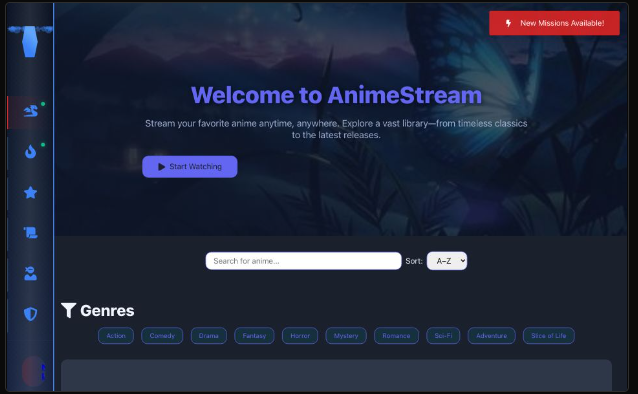

# 🎌 AnimeProject 🍥

**A Next-Generation Anime Streaming & Download Platform | Built with Passion from Scratch**

> ⚠ **Work in Progress:** This project is undergoing continuous enhancements, and more features are being integrated to provide the best anime streaming and downloading experience.

## 📖 Table of Contents

- [✨ Features](#-features)
- [🚀 Quick Start](#-quick-start)
- [📸 Screenshots](#-screenshots)
- [🧩 Tech Stack](#-tech-stack)
- [🧠 Architecture](#-architecture)
- [📌 Roadmap](#-roadmap)
- [🛠️ Planned Features](#%EF%B8%8F-planned-features)
- [🌍 Global Reach](#-global-reach)
- [💡 Why Choose Us?](#-why-choose-us)
- [💬 Community](#-community)
- [❓ FAQs](#-faqs)
- [🤝 Contributing](#-contributing)
- [📜 License](#-license)

## ✨ Features

- 🎥 **High-Quality Anime Streaming & Downloads** - Watch and download anime with ease.`coming soon`
- 🎭 **AI-Powered Recommendations** - Intelligent anime suggestions tailored for users.`comming soon`
- 🔎 **Advanced Search & Filters** - Find anime by genre, year, popularity, and more.
- 🌐 **Multi-Source Streaming** - Content aggregated from various anime platforms.
- 📊 **User Statistics & Analytics** - Track watch history, favorite lists, and trends.
- 🔔 **Real-Time Notifications** - Alerts for new episodes and anime releases.
- 🎨 **Unique & Unmatched UX Design** - A completely new user experience, unlike any existing platform.
- 🌍 **Offline & Online Mode** - Users can manage their anime collection even without an internet connection.`comming soon`
- 🔥 **Interactive Community Features** - Engage with other anime fans through comments and discussions.`comming soon`
- 🏆 **User Rankings & Leaderboards** - Compete and rank among top anime enthusiasts.
- 🛡 **Ad-Free Premium Mode** - Enjoy uninterrupted streaming with a subscription.
- 🎙 **Multi-Language Support** - Subtitles and dubbing options in various languages.
- 🕵️ **Private Mode** - Watch without tracking history for privacy.`comming soon`
- 📅 **Anime Calendar** - Stay updated on upcoming anime releases and events.
- 🎮 **Gamification System** - Earn points, unlock badges, and level up as an anime fan.`Comming soon`

## 🚀 Quick Start

### Prerequisites

- React 18+
- Tailwind CSS
- JSON
- Python Flask (for backend) `Coming soon`

### Installation

```bash
p# Clone repository
git clone https://github.com/clay-boy/anime
cd anime-project

# Install dependencies
npm install

# Configure environment
cp .env.example .env

# Start development server
npm run dev
```

## 📸 Screenshots
 </img>            

## 🧩 Tech Stack

### Frontend:

- React 18 + TypeScript
- Redux Toolkit
- Tailwind CSS
- Framer Motion (for animations)

### Backend:

- Node.js (Express.js)
- PostgreSQL
- Redis
- WebSockets for real-time updates

### AI Components:

- TensorFlow / PyTorch (for recommendation engine)
- Natural Language Processing (for anime metadata analysis)

## 🧠 Architecture

```mermaid
graph TD
    A[Client] -->|GraphQL API| B{Backend Server}
    B --> C[Database (PostgreSQL)]
    B --> D[Recommendation Engine]
    B --> E[Cache (Redis)]
    B --> F[Streaming Sources]
```

## 📌 Roadmap

- ✅ Initial MVP Development
- 🚀 Streaming & Download Enhancements
- 🎭 AI-Powered Recommendations Integration
- 🔔 Improved Notification System
- 🌍 Offline Viewing Capabilities
- 📱 Mobile Application Expansion
- 💬 Community & Social Features
- 🛡 Ad-Free Premium Mode
- 🕵️ Private Watching Mode
- 🎮 Gamification & Rewards System
- 📅 Anime Calendar Integration

## 🛠️ Planned Features

- 🎙 **Multi-Language Support** - Subtitles and dubbing in various languages.
- 🎞 **Interactive Watch Parties** - Watch anime with friends in real-time.
- 📡 **Live Streaming of Anime Events** - Special anime events and premieres.
- 📱 **Dedicated Mobile App** - Optimized for iOS & Android.
- 🏆 **Tournaments & Trivia Challenges** - Engage users with anime-based quizzes.
- 🖥 **VR & AR Experience** - A new way to immerse yourself in anime worlds.
- 📂 **Personalized Anime Library** - Custom collections, watchlists, and favorites.

## 🌍 Global Reach

We aim to make this platform accessible worldwide with localized content, subtitles, and recommendations for different regions.

## 💡 Why Choose Us?

- 🚀 **Speed & Performance** - Optimized for fast streaming with minimal buffering.
- 🤖 **Smart AI System** - Personalized anime recommendations based on user behavior.
- 🎨 **Customizable Themes** - Choose from different UI themes to match your preference.
- 🔒 **Privacy & Security** - Your data is safe with us, and we prioritize user privacy.

## 💬 Community

Join our community and be part of the anime revolution!

- [Discord](#)
- [Twitter](#)
- [Reddit](#)
- [Official Blog](#)

## ❓ FAQs

### 1. What makes this platform unique?

Our platform offers a fresh user experience, AI-powered recommendations, and a completely new interface design that stands apart from other anime streaming services.

### 2. Will there be a mobile app?

Yes! A mobile application for iOS and Android is planned for future releases.

### 3. Is there an ad-free option?

Yes! Users will be able to subscribe to a premium version for an ad-free experience.

### 4. How often is new content added?

New anime and episodes are updated regularly, along with user-requested features.

### 5. Can I request an anime?

Yes! Users will be able to request specific anime titles to be added to the platform.

## 🤝 Contributing

We welcome contributions! Follow these steps to contribute:

1. **Fork the repository**
2. **Create a new branch** (`git checkout -b feature/NewFeature`)
3. **Commit changes** (`git commit -m 'Add new feature'`)
4. **Push to branch** (`git push origin feature/NewFeature`)
5. **Open a Pull Request**

## 📜 License

This project is licensed under the MIT License. See [LICENSE](LICENSE) for details.

---

Made with ❤️ by Anime Fans, for Anime Fans!

Join us on [Discord](#) | Follow us on [Twitter](#) | Connect on [Reddit](#)

